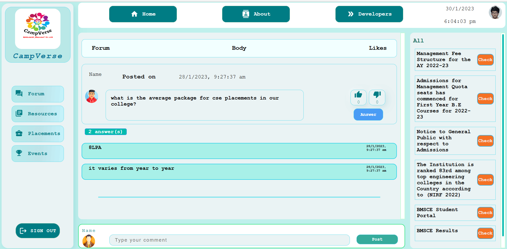
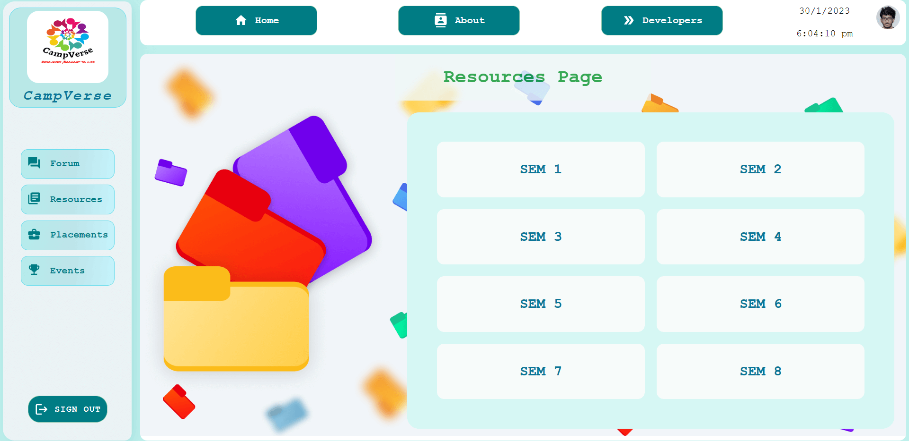
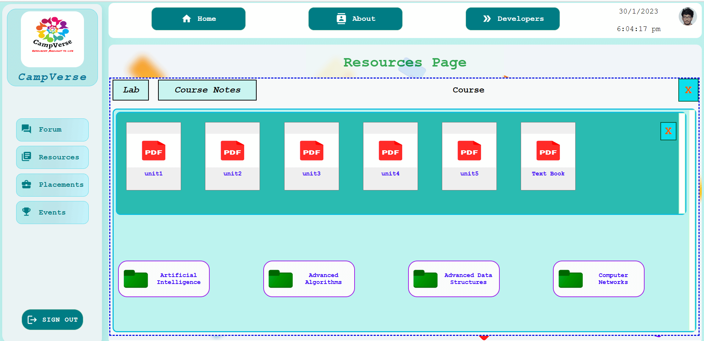
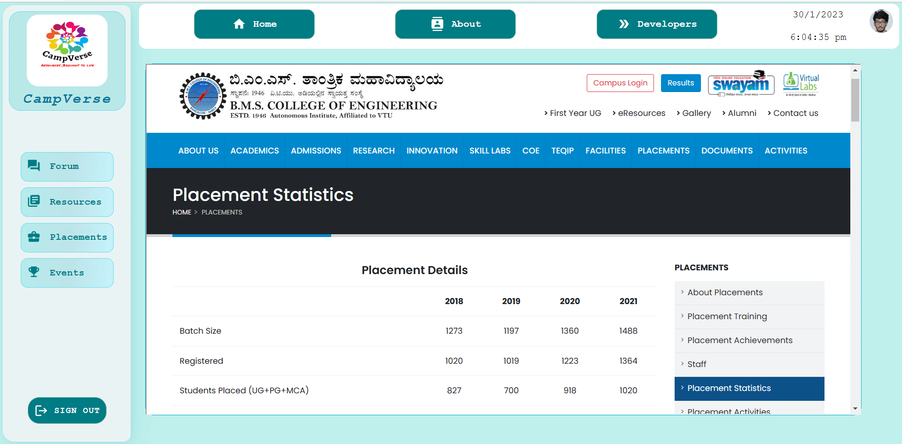
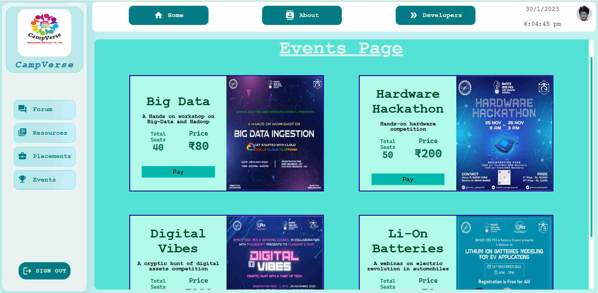
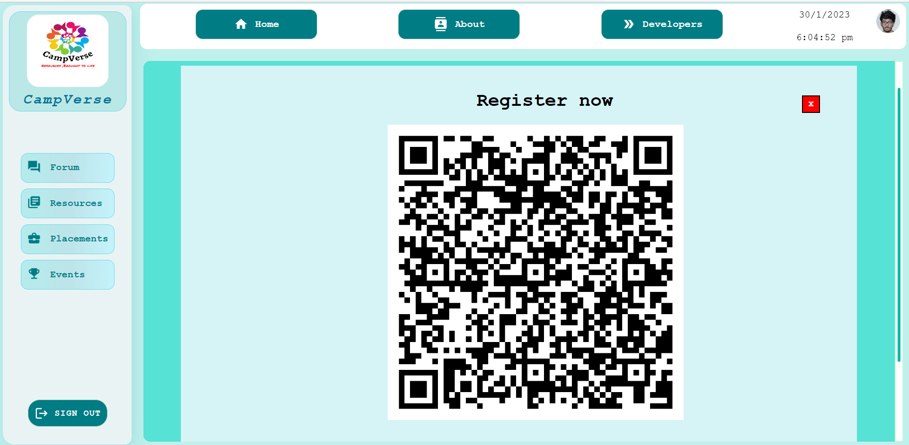
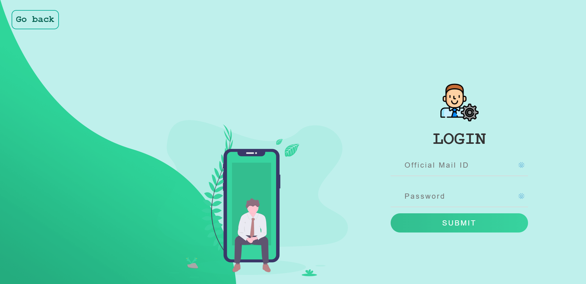
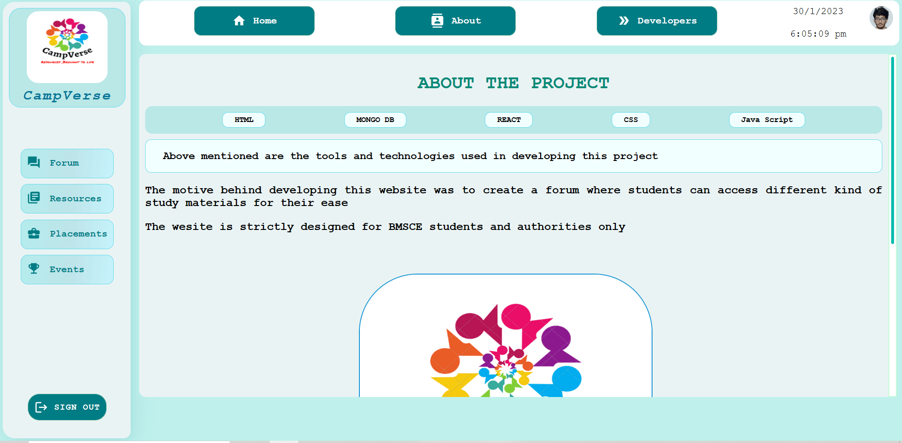
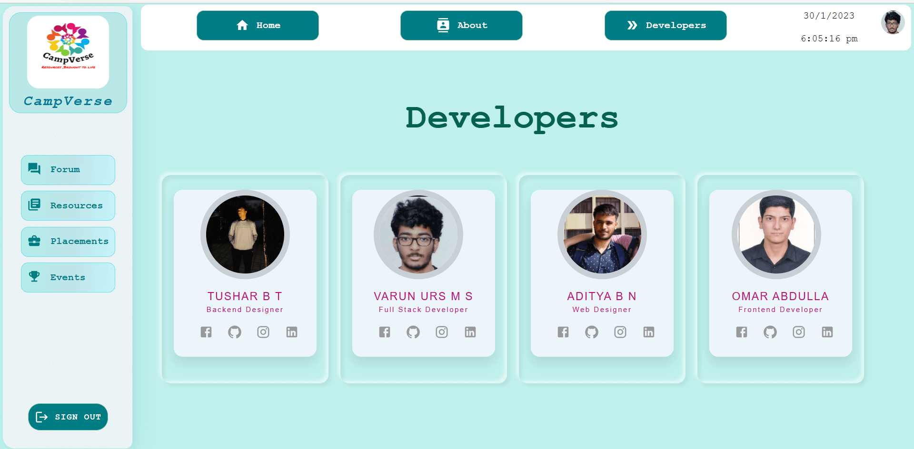

## CampVerse

CampVerse, the ingenious portmanteau of "campus" and "multiverse," represents a visionary project with a mission to integrate diverse academic and cultural platforms seamlessly. This cutting-edge initiative introduces an exclusive community forum for BMS students, fostering interactions with esteemed alumni and mentors. By bridging the gap between students and their university community, CampVerse creates a vibrant hub for collaboration, knowledge sharing, and exploration. With a commitment to nurturing a supportive ecosystem, this transformative project paves the way for an extraordinary academic journey, uniting students in a boundless realm of opportunities and experiences.

<br/>
<br/>

### :rocket: Features

- **Community Forum**: CampVerse offers an exclusive community forum for BMS students, enabling interactions with esteemed alumni and mentors.

- **Seamless Integration**: The project integrates diverse academic and cultural platforms seamlessly, providing a unified experience for users.

- **Vibrant Hub for Collaboration**: CampVerse creates a vibrant hub where students can collaborate, share knowledge, and explore new ideas.

- **Supportive Ecosystem**: The project is committed to nurturing a supportive ecosystem, fostering a sense of belonging and empowerment.


<br/>
<br/>

### :wrench: Tools and Technology

### Frontend


### Backend


### Database


### Design Tools


CampVerse leverages this powerful stack of frontend and backend technologies, along with design tools, to create a dynamic and engaging platform that facilitates seamless interactions and knowledge sharing within the BMS student community. By embracing the latest web development technologies and design principles, CampVerse ensures a smooth and delightful user experience for students, alumni, and mentors alike.


<br/>
<br/>

### :file_folder: Folder Structure

```
campverse/
|-- frontend/
|   |-- src/
|   |-- public/
|-- backend/
|   |-- src/
|-- database/
|-- design/
```

### :arrow_down: Installation

Follow these steps to set up CampVerse on your local machine:

1. Clone the repository:

```
git clone https://github.com/your-username/campverse.git
```

2. Install dependencies for frontend and backend:

```
cd campverse/frontend
npm install

cd ../backend
npm install
```

3. Configure the database:

```
cd ../database
```

# Instructions for setting up the MongoDB database

To set up a MongoDB database in an Express.js application, you'll need to follow these steps:

1. Install required dependencies:
   Make sure you have Node.js and npm (Node Package Manager) installed. Then, create a new directory for your Express.js project and run the following command to initialize a new Node.js project and install the necessary dependencies:

   ```
   npm init -y
   npm install express mongodb
   ```

2. Create an Express.js app file:
   Create a new file named `app.js` or `index.js` (or any other preferred name) in your project directory. This will be the main file for your Express.js application.

3. Import required modules:
   In your `app.js` file, import the required modules:

   ```js
   const express = require('express');
   const mongodb = require('mongodb');
   const MongoClient = mongodb.MongoClient;
   ```

4. Set up Express.js app and MongoDB connection:
   Set up the Express.js app and connect to the MongoDB database. Replace `your_mongodb_uri` with the connection URI of your MongoDB server (e.g., "mongodb://localhost:27017/your_database_name"):

   ```js
   const app = express();
   const port = 3000; // Choose a port number

   const mongoURI = 'your_mongodb_uri';

   MongoClient.connect(
     mongoURI,
     { useNewUrlParser: true, useUnifiedTopology: true },
     (err, client) => {
       if (err) {
         console.error('Error connecting to MongoDB:', err);
       } else {
         console.log('Connected to MongoDB!');
         const db = client.db(); // Replace with your database name if not the default

         // Start your Express.js app here
         app.listen(port, () => {
           console.log(`Server is running on http://localhost:${port}`);
         });
       }
     }
   );
   ```

5. Define routes and controllers:
   Now that your Express.js app is set up and connected to MongoDB, you can define routes and controllers to handle various HTTP requests. These routes will interact with the database. For example:


6. Start your application:
   Run your Express.js application using the following command:

   ```
   node app.js
   ```

   Your application will start, and you can visit `http://localhost:3000/users` (assuming you defined the `/users` route) to test the route you created.

Remember to properly handle errors, implement security measures, and follow best practices when deploying your Express.js application with MongoDB. You might also want to consider using a middleware like `body-parser` to handle request bodies and `dotenv` to manage environment variables securely.


4. Start the development server:

```
cd ../frontend
npm start

cd ../backend
npm start
```

<br/>
<br/>

### :framed_picture: Project Snapshots

### Forumpage


### ResourcesPage


### pdfPage


### Placements


### EventsPage


### Payment


### Home


### Login


### About


### Developers


<br/>
<br/>

### :handshake: Contributing

We welcome contributions from the open-source community! To contribute, follow the guidelines specified in the `CONTRIBUTING.md` file.

<br/>
<br/>

### :loudspeaker: Feedback and Support

We value your feedback and are here to support you. If you encounter any issues or have suggestions, please open an issue on our GitHub repository or reach out to our team via email.

Let's embark on an extraordinary academic journey together with CampVerse! Join us in this boundless realm of opportunities and experiences.
